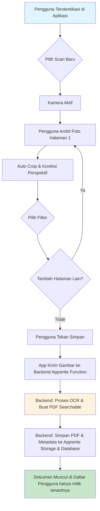
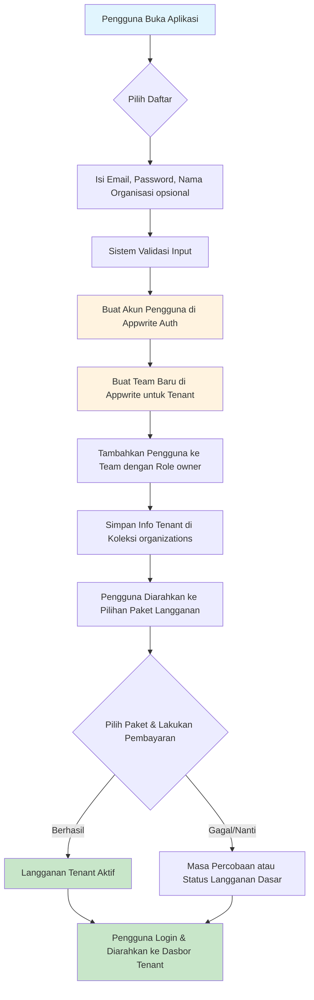
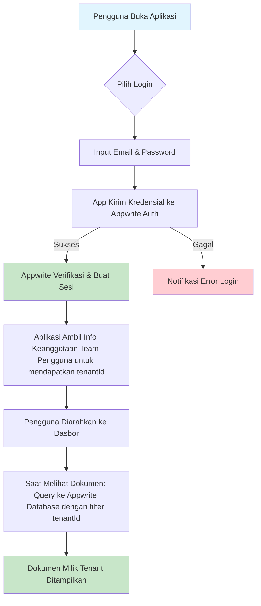

# Spesifikasi Kebutuhan Perangkat Lunak (SRS) - Aplikasi Document Scanner SaaS (MVP)

**Versi Dokumen:** 1.1
**Tanggal:** 28 Mei 2025
**Penyusun:** [Alfin Fadila Reza/Tim Anda]

## 1. Pendahuluan

### 1.1. Tujuan Dokumen
Dokumen ini mendefinisikan kebutuhan fungsional dan non-fungsional untuk Minimum Viable Product (MVP) dari Aplikasi Document Scanner SaaS. Aplikasi ini bertujuan untuk menyediakan solusi pemindaian dokumen berkualitas tinggi, konversi ke PDF yang dapat dicari (searchable PDF) melalui OCR, dan penyimpanan cloud yang aman bagi pengguna individu dan organisasi kecil dalam lingkungan multi-tenant.

### 1.2. Ruang Lingkup Produk
MVP akan fokus pada fitur inti pemindaian melalui perangkat mobile (iOS & Android), pemrosesan gambar otomatis, OCR, pembuatan PDF yang dapat dicari, penyimpanan cloud terintegrasi dalam satu Project Appwrite dengan isolasi data per tenant, dan manajemen akun dasar. Pengguna dapat berlangganan untuk mengakses fitur-fitur ini.

### 1.3. Definisi, Akronim, dan Singkatan
*   **SaaS:** Software as a Service
*   **MVP:** Minimum Viable Product
*   **OCR:** Optical Character Recognition
*   **PDF:** Portable Document Format
*   **UI:** User Interface
*   **UX:** User Experience
*   **SRS:** Software Requirements Specifications
*   **Appwrite:** Backend as a Service platform yang digunakan.
*   **Tenant:** Organisasi atau pengguna yang datanya terisolasi secara logis dalam satu Project Appwrite, diidentifikasi dengan `tenantId` (yang merupakan `teamId` Appwrite).
*   **Team:** Fitur di Appwrite untuk mengelompokkan pengguna, digunakan untuk merepresentasikan Tenant/Organisasi.
*   **Role:** Peran pengguna di dalam sebuah Team (misalnya, owner, admin, member).

## 2. Deskripsi Umum

### 2.1. Perspektif Produk
Aplikasi ini adalah sistem mandiri yang akan diakses oleh pengguna melalui aplikasi mobile (Flutter) dan antarmuka web dasar (untuk manajemen akun dan akses dokumen). Backend akan dikelola menggunakan satu Project Appwrite. Arsitektur multi-tenant akan diimplementasikan dengan menggunakan satu Database Appwrite, di mana data setiap tenant (organisasi) diisolasi secara logis menggunakan atribut `tenantId` pada setiap koleksi relevan. Fitur Appwrite Teams akan digunakan untuk merepresentasikan setiap tenant, dan Appwrite Permissions akan ditegakkan secara ketat untuk memastikan keamanan dan privasi data antar tenant.

### 2.2. Fungsi Produk (Ringkasan Fitur MVP)
1.  **Pemindaian Dokumen Mobile Berkualitas Tinggi:** (Sama seperti sebelumnya)
2.  **OCR dan Pembuatan PDF yang Dapat Dicari:** (Sama seperti sebelumnya)
3.  **Penyimpanan Cloud Terintegrasi & Sinkronisasi Sederhana:** (Sama seperti sebelumnya, dengan penekanan pada penyimpanan dalam satu Project Appwrite dengan isolasi `tenantId`)
4.  **Manajemen Dokumen Dasar:** (Sama seperti sebelumnya, dengan query yang selalu menyertakan filter `tenantId`)
5.  **Manajemen Akun Pengguna, Tenant (Organisasi), & Langganan:**
    *   Registrasi pengguna baru dan pembuatan Tenant (Organisasi/Team) secara otomatis.
    *   Login pengguna.
    *   Pengelolaan pengguna dalam Tenant (jika ada fitur multi-user per tenant di masa depan, MVP fokus pada satu pengguna per tenant sebagai owner).
    *   Pengaturan profil dasar pengguna.
    *   Manajemen langganan (pilihan paket, pembayaran, status langganan) per Tenant.

### 2.3. Karakteristik Pengguna (User Persona)
(Sama seperti sebelumnya)

### 2.4. Lingkungan Operasi
(Sama seperti sebelumnya)

### 2.5. Batasan Desain dan Implementasi
*   MVP akan menggunakan Flutter untuk pengembangan aplikasi mobile.
*   Backend akan menggunakan **satu Project Appwrite** dengan **satu Database**.
*   Arsitektur multi-tenant akan diimplementasikan dengan atribut `tenantId` (merujuk ke `teamId` Appwrite) pada koleksi data, dan penggunaan Appwrite Teams & Permissions untuk isolasi data.
*   Proses OCR akan diimplementasikan menggunakan Appwrite Functions.
*   Integrasi pembayaran akan menggunakan payment gateway pihak ketiga (misalnya, Midtrans, Stripe).
*   Fokus awal pada bahasa Indonesia dan Inggris untuk OCR dan UI.

## 3. Kebutuhan Spesifik

### 3.1. Kebutuhan Fungsional

#### 3.1.1. Modul Pemindaian Dokumen (Mobile)
(Semua FU-SCAN-xxx sama seperti sebelumnya)
*   **FU-SCAN-007: Simpan Sesi Pemindaian**
    *   Deskripsi: Pengguna dapat menyimpan sesi pemindaian multi-halaman sebagai satu dokumen.
    *   Input: Perintah dari pengguna untuk menyimpan, nama dokumen (opsional).
    *   Proses:
        1.  Semua gambar halaman yang diproses dikirim ke backend.
        2.  Backend memicu proses OCR.
        3.  Backend menggabungkan halaman-halaman menjadi satu file PDF.
        4.  Backend menyimpan metadata dokumen (termasuk `tenantId` pengguna saat ini) dan file PDF ke penyimpanan cloud Appwrite.
    *   Output: Dokumen baru tersimpan di cloud dan muncul di daftar dokumen pengguna (yang difilter berdasarkan `tenantId` pengguna). Notifikasi keberhasilan.

#### 3.1.2. Modul OCR dan Pembuatan PDF
(Semua FU-OCR-xxx sama seperti sebelumnya)

#### 3.1.3. Modul Penyimpanan Cloud dan Sinkronisasi
*   **FU-CLOUD-001: Unggah Otomatis ke Cloud**
    *   Deskripsi: Setiap dokumen yang berhasil dipindai dan diproses akan otomatis diunggah dan disimpan di penyimpanan cloud Appwrite, diasosiasikan dengan `tenantId` pengguna.
    *   Input: File PDF yang dapat dicari, metadata dokumen.
    *   Proses: File diunggah ke Appwrite Storage, metadata (termasuk `tenantId`) disimpan di Appwrite Database. Izin akses diatur berdasarkan `tenantId` (Team).
    *   Output: Dokumen tersimpan dengan aman di cloud.
*   **FU-CLOUD-002: Kuota Penyimpanan** (Sama seperti sebelumnya, kuota berlaku per Tenant/Team)
*   **FU-CLOUD-003: Akses Dokumen Lintas Perangkat**
    *   Deskripsi: Pengguna dapat mengakses dokumen yang tersimpan di cloud (milik Tenant mereka) dari aplikasi mobile dan antarmuka web.
    *   Input: Login pengguna.
    *   Proses: Aplikasi mengambil daftar dokumen dan file dari cloud Appwrite, dengan query yang difilter berdasarkan `tenantId` pengguna saat ini dan ditegakkan oleh Appwrite Permissions.
    *   Output: Daftar dokumen dan konten dokumen ditampilkan.

#### 3.1.4. Modul Manajemen Dokumen
*   **FU-MANAGE-001: Tampilkan Daftar Dokumen**
    *   Deskripsi: Pengguna dapat melihat daftar semua dokumen yang telah mereka pindai dan simpan, yang dimiliki oleh Tenant mereka.
    *   Input: -
    *   Proses: Aplikasi mengambil daftar metadata dokumen dari Appwrite Database, difilter berdasarkan `tenantId` pengguna saat ini.
    *   Output: Daftar dokumen ditampilkan.
*   **FU-MANAGE-002: Ganti Nama Dokumen**
    *   Deskripsi: Pengguna dapat mengganti nama file dokumen yang sudah ada milik Tenant mereka.
    *   Input: ID dokumen, nama baru.
    *   Proses: Metadata nama dokumen di Appwrite Database diperbarui, setelah verifikasi bahwa pengguna memiliki izin untuk dokumen dengan `tenantId` tersebut.
    *   Output: Nama dokumen diperbarui di daftar.
*   **FU-MANAGE-003: Hapus Dokumen**
    *   Deskripsi: Pengguna dapat menghapus dokumen milik Tenant mereka dari penyimpanan cloud.
    *   Input: ID dokumen.
    *   Proses: File dokumen di Appwrite Storage dan metadata di Appwrite Database dihapus, setelah verifikasi izin berdasarkan `tenantId`.
    *   Output: Dokumen hilang dari daftar.
*   **FU-MANAGE-004: Urutkan Dokumen** (Sama seperti sebelumnya, diterapkan pada data yang sudah difilter `tenantId`)
*   **FU-MANAGE-005: Unduh Dokumen** (Sama seperti sebelumnya, diterapkan pada data yang sudah difilter `tenantId`)

#### 3.1.5. Modul Manajemen Akun Pengguna, Tenant (Organisasi), & Langganan
*   **FU-USER-001: Registrasi Pengguna Baru dan Pembuatan Tenant**
    *   Deskripsi: Pengguna baru dapat membuat akun, yang secara otomatis juga membuat Tenant (Organisasi) baru di mana pengguna tersebut menjadi 'owner'.
    *   Input: Email, password, nama organisasi (opsional, bisa default).
    *   Proses:
        1.  Validasi input.
        2.  Membuat entri pengguna baru di Appwrite Authentication.
        3.  Membuat Team baru di Appwrite untuk merepresentasikan Tenant. Dapatkan `teamId` (ini akan menjadi `tenantId`).
        4.  Menambahkan pengguna yang baru dibuat sebagai member dari Team tersebut dengan role 'owner'.
        5.  (Opsional) Menyimpan metadata Tenant (misalnya, nama organisasi, `ownerUserId`, `teamId` sebagai `tenantId`, status langganan awal) di koleksi `organizations`.
    *   Output: Akun pengguna dan Tenant berhasil dibuat. Pengguna diarahkan ke proses pemilihan langganan atau masa percobaan.
*   **FU-USER-002: Login Pengguna**
    *   Deskripsi: Pengguna yang sudah terdaftar dapat masuk ke aplikasi.
    *   Input: Email, password.
    *   Proses: Otentikasi kredensial melalui Appwrite Authentication. Mengambil informasi keanggotaan Team pengguna untuk menentukan `tenantId` sesi.
    *   Output: Pengguna berhasil login dan diarahkan ke dasbor/daftar dokumen milik Tenant-nya.
*   **FU-USER-003: Logout Pengguna** (Sama seperti sebelumnya)
*   **FU-USER-004: Pengaturan Profil Dasar** (Sama seperti sebelumnya)
*   **FU-SUB-001: Pilihan Paket Langganan**
    *   Deskripsi: Tenant (melalui user owner) dapat melihat paket langganan yang tersedia.
    *   Input: -
    *   Proses: Menampilkan informasi paket dari konfigurasi aplikasi atau database.
    *   Output: Daftar paket langganan.
*   **FU-SUB-002: Proses Pembayaran Langganan**
    *   Deskripsi: Tenant (melalui user owner) dapat memilih paket dan melakukan pembayaran.
    *   Input: Pilihan paket, detail pembayaran.
    *   Proses: Integrasi dengan payment gateway. Setelah pembayaran berhasil, status langganan Tenant (di koleksi `organizations` atau metadata Team) diperbarui.
    *   Output: Notifikasi pembayaran berhasil, langganan Tenant aktif.
*   **FU-SUB-003: Lihat Status Langganan Tenant**
    *   Deskripsi: Pengguna (terutama owner) dapat melihat status langganan Tenant mereka.
    *   Input: -
    *   Proses: Mengambil data langganan Tenant.
    *   Output: Informasi status langganan ditampilkan.

### 3.2. Kebutuhan Non-Fungsional

*   **NF-PERF-001: Kinerja Pemindaian & OCR** (Sama seperti sebelumnya)
*   **NF-SEC-001: Keamanan Data dan Isolasi Tenant**
    *   Deskripsi: Semua data dokumen harus dienkripsi saat transit (HTTPS) dan saat disimpan. **Isolasi data antar tenant harus ditegakkan secara ketat melalui atribut `tenantId` dan konfigurasi Appwrite Permissions (berbasis Team & Role).** Kesalahan konfigurasi tidak boleh menyebabkan kebocoran data.
*   **NF-SEC-002: Otentikasi Aman** (Sama seperti sebelumnya)
*   **NF-SEC-003: Konfigurasi Permissions yang Benar**
    *   Deskripsi: Konfigurasi permissions di Appwrite (document-level dan collection-level) harus dirancang dan diuji secara menyeluruh untuk memastikan hanya pengguna yang berhak dari Tenant yang benar yang dapat mengakses atau memodifikasi data.
*   **NF-USAB-001: Kemudahan Penggunaan** (Sama seperti sebelumnya)
*   **NF-AVAIL-001: Ketersediaan Layanan (Target Awal)** (Sama seperti sebelumnya)
*   **NF-SCALE-001: Skalabilitas Tenant dalam Satu Project**
    *   Deskripsi: Sistem harus dapat menangani penambahan tenant baru dalam satu Project Appwrite. Penggunaan indeks pada atribut `tenantId` penting untuk menjaga kinerja query seiring bertambahnya jumlah tenant dan data.
*   **NF-STORE-001: Integritas Data** (Sama seperti sebelumnya)

### 3.3. Kebutuhan Antarmuka Eksternal
(Sama seperti sebelumnya)

## 4. Diagram Alur Pengguna Utama

### 4.1. Alur Pemindaian Dokumen Baru (User Terotentikasi)

4.2. Alur Registrasi Pengguna Baru dan Pembuatan Tenant

4.3. Alur Login Pengguna dan Akses Data Tenant

5. Kriteria Penerimaan (Acceptance Criteria) - Contoh untuk Fitur Utama

Pemindaian & Auto Crop: (Sama seperti sebelumnya)

OCR Akurasi: (Sama seperti sebelumnya)

Searchable PDF: (Sama seperti sebelumnya)

Login: (Sama seperti sebelumnya)

Isolasi Data Tenant: Pengguna dari Tenant A tidak dapat melihat, mengubah, atau menghapus data milik Tenant B dalam kondisi apapun. Pengujian penetrasi dasar harus dilakukan untuk memverifikasi ini.

Dokumen ini akan menjadi panduan untuk tim pengembangan dalam membangun MVP Aplikasi Document Scanner SaaS. Dokumen ini bersifat hidup dan dapat diperbarui seiring dengan perkembangan proyek dan feedback yang diterima.

