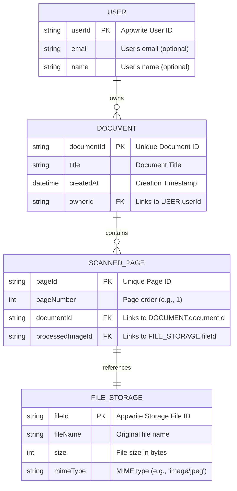

---

# 📊 Entity-Relationship Diagram (ERD) – ScanApp MVP

Diagram ini memvisualisasikan bagaimana data **User**, **Document**, **Scanned Page**, dan **File Storage** saling terhubung di dalam backend **Appwrite**.

---

## 📌 Penjelasan Detail ERD

### 1. Entitas (Kotak Persegi)

- **USER**

  - Representasi pengguna aplikasi.
  - Walaupun login anonim, Appwrite tetap membuat `userId` unik.
  - **userId (PK)**: Primary Key unik.
  - **email & name (opsional)**: bisa kosong pada login anonim.

- **DOCUMENT**

  - Representasi dokumen hasil pindaian (contoh: _Kwitansi Oktober_, _Tugas Kalkulus_).
  - **documentId (PK)**: unik untuk setiap dokumen.
  - **title**: judul dokumen.
  - **createdAt**: timestamp pembuatan.
  - **ownerId (FK)**: relasi ke `USER.userId`.

- **SCANNED_PAGE**

  - Representasi halaman dalam dokumen.
  - **pageId (PK)**: unik untuk setiap halaman.
  - **pageNumber**: urutan halaman (1, 2, 3, …).
  - **documentId (FK)**: relasi ke `DOCUMENT.documentId`.
  - **processedImageId (FK)**: relasi ke `FILE_STORAGE.fileId`.

- **FILE_STORAGE**

  - Representasi file hasil scan di Appwrite Storage.
  - **fileId (PK)**: ID file unik di Appwrite.
  - **fileName**: nama file asli.
  - **size**: ukuran file (bytes).
  - **mimeType**: tipe file (contoh: `image/jpeg`).

---

### 2. Relasi (Garis Penghubung)

- **USER → DOCUMENT**

  - Satu **User** dapat memiliki banyak **Document**.
  - Kardinalitas: `1-to-many`.

- **DOCUMENT → SCANNED_PAGE**

  - Satu **Document** dapat memiliki banyak **Scanned Page**.
  - Kardinalitas: `1-to-many`.
  - ⚠️ Di MVP hanya 1 halaman/dokumen, tapi skema sudah siap multi-halaman.

- **SCANNED_PAGE → FILE_STORAGE**

  - Satu **Scanned Page** harus merujuk ke **satu file di Storage**.
  - Kardinalitas: `1-to-1`.

---
