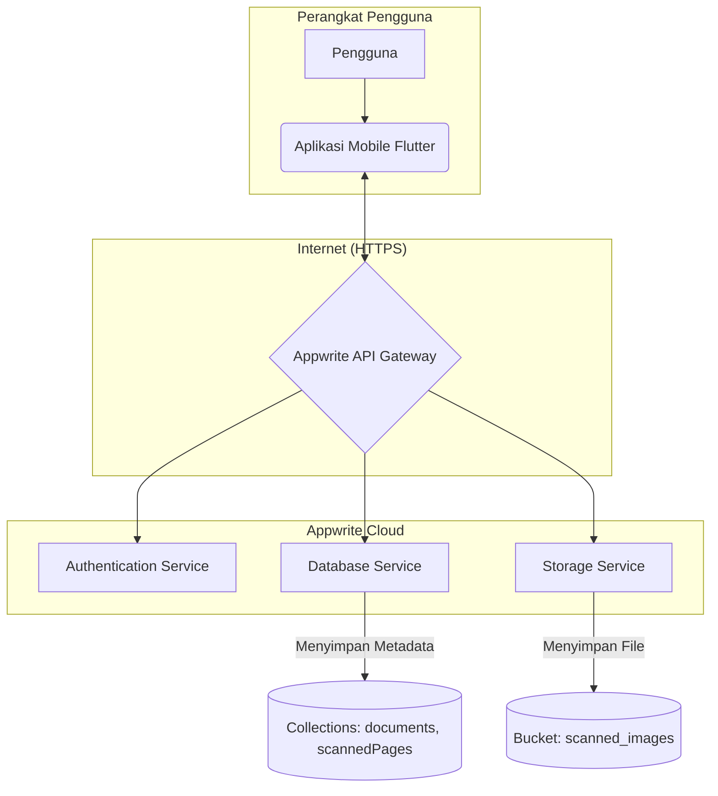
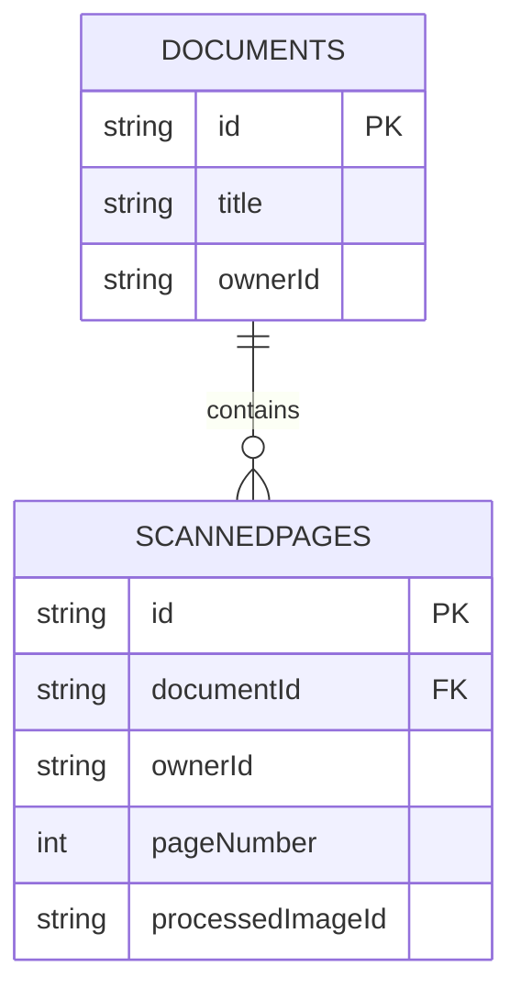

---

# 📄 Software Design Document (SDD): ScanApp MVP

**Status:** Final – Versi 1.0
**Penulis:** \[Nama Anda]
**Tanggal:** 27 Oktober 2023
**Referensi:** PRD v1.0, SRS v1.0

---

## 1. Pendahuluan

### 1.1 Tujuan Dokumen

Dokumen ini merinci desain teknis untuk aplikasi **ScanApp MVP**. Tujuannya adalah:

* Memberikan panduan implementasi bagi tim developer.
* Menjamin konsistensi, skalabilitas, dan maintainability.
* Menjabarkan arsitektur, desain frontend/backend, model data, dan aspek keamanan.

### 1.2 Ruang Lingkup

SDD mencakup fitur utama dari SRS v1.0:

* Pemindaian 1 halaman.
* Pemrosesan gambar (crop, filter).
* Penyimpanan cloud per pengguna.
* Fitur berbagi hasil scan.

🚫 Tidak termasuk dalam lingkup MVP: multi-page scan, OCR, integrasi pihak ketiga lanjutan.

---

## 2. Arsitektur Sistem

ScanApp menggunakan arsitektur **Client–Server** sederhana:

* **Client:** Aplikasi Flutter (Android & iOS).
* **Server:** Appwrite Cloud (BaaS).



### Alur Data

1. **Frontend (Flutter):** Interaksi pengguna, pemrosesan gambar ringan, menampilkan data.
2. **Backend (Appwrite):** Otentikasi, manajemen metadata dokumen, penyimpanan file.
3. **Komunikasi:** Flutter SDK → RESTful API → HTTPS.

---

## 3. Desain Frontend (Flutter)

### 3.1 Pola Arsitektur

* **MVVM** (Model–View–ViewModel).
* **Provider** untuk state management.

### 3.2 Struktur Direktori

```
lib/
├── main.dart
├── models/          # Data models (document.dart, page.dart)
├── providers/       # ViewModels
│   └── document_provider.dart
├── screens/         # UI Screens
│   ├── camera_screen.dart
│   ├── edit_screen.dart
│   └── home_screen.dart
├── services/        # API & backend services
│   ├── appwrite_client.dart
│   ├── auth_service.dart
│   └── database_service.dart
└── widgets/         # Reusable UI widgets
    └── document_card.dart
```

### 3.3 Komponen Utama

* **HomeScreen** → menampilkan daftar dokumen.
* **CameraScreen** → akses kamera & capture dokumen.
* **EditScreen** → crop, filter, rotasi, simpan ke database.
* **DocumentProvider** → fetch, add, delete dokumen.

### 3.4 Dependensi

* `appwrite` (backend).
* `provider` (state management).
* `camera` (akses kamera).
* `edge_detection` (deteksi tepi dokumen).
* `pdf` (generate PDF).
* `share_plus` (berbagi file).

---

## 4. Desain Backend (Appwrite)

### 4.1 Model Data & ERD



* **documents**: metadata dokumen.
* **scannedPages**: halaman hasil scan, terkait dengan `documentId`.
* **scanned\_images (Storage)**: menyimpan file gambar hasil scan.

### 4.2 API Service Contracts

**auth\_service.dart**

```dart
class AuthService {
  Future<void> loginAnonymously();
  Future<String?> getCurrentUserId();
}
```

**database\_service.dart**

```dart
class DatabaseService {
  Future<String> uploadImage(File file);
  Future<void> createDocument(String title, String imageFileId);
  Future<List<DocumentModel>> getDocuments();
  Future<void> deleteDocument(String documentId, String imageFileId);
  Future<Uint8List> getImageFile(String fileId);
}
```

---

## 5. Desain Keamanan

* **Authentication:** login anonim via Appwrite.
* **Authorization:** izin berbasis `ownerId` (document-level permissions).
* **Data in Transit:** semua komunikasi terenkripsi HTTPS/TLS.
* **API Keys:** tidak disimpan di client, hanya `Project ID` & `Endpoint`.

---

## 6. Pertimbangan Lain

* **Error Handling:** pakai `try-catch` + user-friendly error message.
* **Kinerja:** gunakan `storage.getFilePreview()` untuk thumbnail agar hemat bandwidth.
* **Indexing:** index pada `documentId` di koleksi `scannedPages`.

---

## 7. Lampiran

* **Tools yang digunakan:**

  * Flutter SDK
  * Appwrite Cloud
  * VS Code + Markdown Preview Mermaid

---
