Saya akan menggunakan sintaks graph TD (Top-Down) untuk alur dan gantt untuk visualisasi jadwal kasar. Namun, karena keterbatasan Mermaid dalam menampilkan kedua jenis visualisasi secara bersamaan dengan detail yang sama, saya akan fokus pada diagram alir proses dengan anotasi durasi, dan kemudian memberikan contoh diagram Gantt terpisah untuk jadwal.

Diagram Alir Proses Iterasi MVP dengan Anotasi Durasi

```mermaid
graph TD
    A["🚀 Iterasi 0: Persiapan & Pengaturan Proyek<br/>(1 Minggu)"] --> B
    B["🔐 Iterasi 1: Fondasi Otentikasi &<br/>Manajemen Tenant Dasar<br/>(1-2 Minggu)"] --> C
    C["📱 Iterasi 2: Inti Pemindaian Dokumen<br/>(Mobile - Lokal)<br/>(2-3 Minggu)"] --> D
    D["☁️ Iterasi 3: Integrasi Cloud Storage &<br/>Sinkronisasi Dasar<br/>(1 Minggu)"] --> E
    E["🔍 Iterasi 4: Implementasi OCR &<br/>PDF Searchable<br/>(2-3 Minggu)"] --> F
    F["📄 Iterasi 5: Manajemen Dokumen<br/>(CRUD & Tampilan)<br/>(1-2 Minggu)"] --> G
    G["💳 Iterasi 6: Manajemen Langganan &<br/>Pembayaran<br/>(2-3 Minggu)"] --> H
    H["🌐 Iterasi 7: Antarmuka Web Minimal &<br/>Pengujian Akhir<br/>(2 Minggu)"] --> I
    I["✅ MVP Siap untuk Rilis Awal"]

    %% Styling untuk setiap node
    classDef startNode fill:#e1f5fe,stroke:#01579b,stroke-width:3px,color:#000
    classDef authNode fill:#f3e5f5,stroke:#4a148c,stroke-width:2px,color:#000
    classDef coreNode fill:#e8f5e8,stroke:#1b5e20,stroke-width:2px,color:#000
    classDef cloudNode fill:#fff3e0,stroke:#e65100,stroke-width:2px,color:#000
    classDef ocrNode fill:#fce4ec,stroke:#880e4f,stroke-width:2px,color:#000
    classDef mgmtNode fill:#f1f8e9,stroke:#33691e,stroke-width:2px,color:#000
    classDef paymentNode fill:#fff8e1,stroke:#ff6f00,stroke-width:2px,color:#000
    classDef webNode fill:#e3f2fd,stroke:#0d47a1,stroke-width:2px,color:#000
    classDef finalNode fill:#c8e6c9,stroke:#2e7d32,stroke-width:4px,color:#000

    %% Aplikasi styling ke node
    class A startNode
    class B authNode
    class C coreNode
    class D cloudNode
    class E ocrNode
    class F mgmtNode
    class G paymentNode
    class H webNode
    class I finalNode
```

Penjelasan Diagram Alir:

1.Setiap kotak merepresentasikan satu iterasi.
2.Deskripsi singkat tujuan iterasi dan perkiraan durasi dalam minggu disertakan.
3.Panah menunjukkan urutan pengerjaan iterasi.
4.Diagram Gantt Kasar untuk Jadwal Iterasi MVP
5.Diagram Gantt lebih cocok untuk visualisasi jadwal.

Berikut adalah contoh bagaimana Anda bisa merepresentasikannya menggunakan sintaks Gantt di Mermaid:

Penjelasan Diagram Gantt:
dateFormat: Menentukan format tanggal yang digunakan.
title: Judul diagram.
excludes weekends: (Opsional) Jika Anda ingin perhitungan durasi tidak menyertakan akhir pekan.

section: (Opsional) Untuk mengelompokkan tugas.

Format Tugas: Nama Tugas :status, id_tugas, tanggal_mulai_atau_dependensi, durasi

Nama Tugas: Deskripsi iterasi.

status: Bisa active, done, crit (kritis). Saya menggunakan crit untuk menandakan jalur utama.

id_tugas: ID unik untuk referensi dependensi (misalnya, itr0, itr1).

tanggal_mulai_atau_dependensi: Bisa tanggal spesifik (YYYY-MM-DD) atau dependensi (after id_tugas_sebelumnya).

durasi: Dalam format Xw (minggu), Xd (hari).

Total Estimasi Durasi MVP (berdasarkan perkiraan tengah):

Iterasi 0: 1 minggu

Iterasi 1: 1.5 minggu

Iterasi 2: 2.5 minggu

Iterasi 3: 1 minggu

Iterasi 4: 2.5 minggu

Iterasi 5: 1.5 minggu

Iterasi 6: 2.5 minggu

Iterasi 7: 2 minggu

Total Perkiraan: 14.5 minggu (sekitar 3.5 - 4 bulan)

Penting untuk Diingat:

Estimasi Kasar: Durasi ini adalah estimasi. Kompleksitas sebenarnya, jumlah bug, perubahan kebutuhan, dan ketersediaan sumber daya akan sangat mempengaruhi jadwal aktual.

Overlap (Paralelisasi): Beberapa tugas dalam iterasi atau bahkan antar iterasi mungkin bisa dikerjakan secara paralel jika Anda memiliki tim lebih dari satu orang. Diagram Gantt bisa dimodifikasi untuk menunjukkan ini, tetapi untuk MVP awal dengan tim kecil, pendekatan sekuensial seringkali lebih realistis.

Buffer Time: Selalu bijaksana untuk menambahkan buffer time (misalnya 10-20%) ke total estimasi untuk mengatasi hal-hal tak terduga.

Fleksibilitas: Agile berarti bersiap untuk beradaptasi. Jika satu iterasi memakan waktu lebih lama, Anda mungkin perlu menyesuaikan cakupan atau jadwal iterasi berikutnya.

Fokus MVP: Ingatlah bahwa ini adalah untuk Minimum Viable Product. Fitur-fitur tambahan atau penyempurnaan bisa datang di versi berikutnya.

